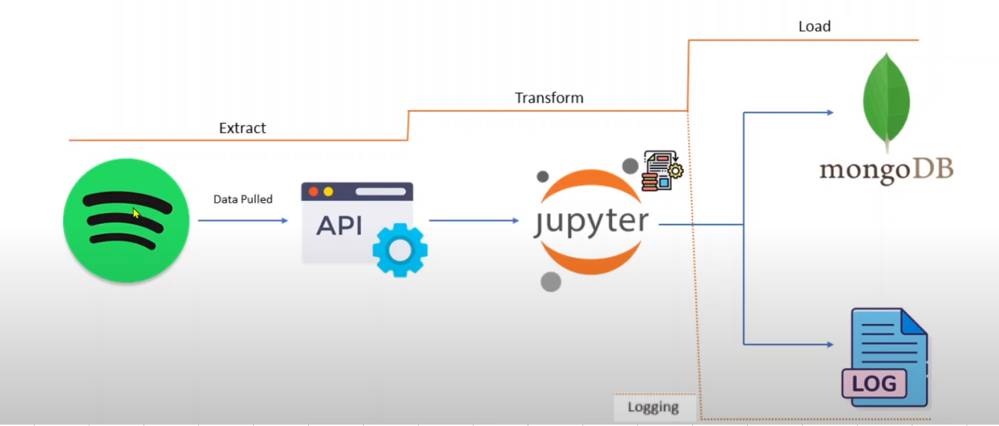
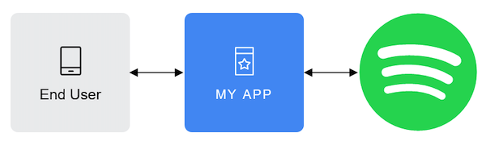

# DATA PIPELINE ARCHITECTURE  

<h2 style="margin-left: 200px;"> 🤖 Building Spotify  Data Pipeline 🤖 </h2>

<h4></b>In this project, I have build an ETL(extract,Transform,Load) pipeline using the spotify API on local machine. The Pipeline will retrive data from the Spotify API, Tranform it to a desired format, and load it into an Mongodb database. 
  For user authentication I have used flask python framework only for one time authorisation.</h4>
  
# USEFUL LINKS  

<h4 style="text-align: left;">Important Websites</h4>
<p><a href='https://developer.spotify.com/documentation/web-api'>Spotify Web API : </a>Retrieve metadata from Spotify content, control playback or get recommendations</p>
<p><a href='https://developer.spotify.com/documentation/web-api/concepts/apps'>Create an App : </a>The app provides, among others, the Client ID and Client Secret needed to implement any of the authorization flows.</p>
<p><a href='https://developer.spotify.com/documentation/web-api/concepts/authorization'>Authorization : </a>Authorization refers to the process of granting a user or application access permissions to Spotify data and features (e.g your application needs permission from a user to access their playlists).

<p>Spotify implements the OAuth 2.0 authorization framework.</p>

<p><a href='https://developer.spotify.com/documentation/web-api/tutorials/code-flow'>Authorization Code Flow : </a> We use the authorization code flow  because it is suitable for long-running applications where the user grants permission only once.</p>

<p><a href='https://developer.spotify.com/documentation/web-api/concepts/scopes'>Scopes : </a>Scopes provide Spotify users using third-party apps the confidence that only the information they choose to share will be shared, and nothing more. </p>
<p> If the user is not logged in, they are prompted to do so using their Spotify credentials. When the user is logged in, they are asked to authorize access to the data sets or features defined in the scopes.</p>

<p><a href='https://developer.spotify.com/documentation/web-api/tutorials/refreshing-tokens'>Refreshing tokens :</a>Access tokens are intentionally configured to have a limited lifespan (1 hour), at the end of which, new tokens can be obtained by providing the original refresh token acquired during the authorization token request response.</p>

<p><a href='</p>https://pymongo.readthedocs.io/en/stable/examples/authentication.html'>PyMongo :  </a>PyMongo is a Python distribution containing tools for working with MongoDB, and is the recommended way to work with MongoDB from Python. This documentation attempts to explain everything you need to know to use PyMongo.</p>

<p><a href='</p>https://flask.palletsprojects.com/en/3.0.x/quickstart/#routing'>Flask :  </a>Flask is a micro web framework written in Python.</p>

# SPOTIFY APP DASHBOARD 

<div class="parent" style="display: flex;">
  <div>
    
  </div>
  <div>
    
  </div>
</div>


### Built With

* Python / Notebook / Flask
* MongoDB
* Spotify API


<!-- GETTING STARTED -->
## Getting Started

To get a local copy up and running follow these simple steps:

1. Clone the repo
```sh
git clone https://github.com/codeXXripper/Spotify--Data-Pipeline
```
2. Run the flask python script first
3. Execute the ETL python notebook
4. Enjoy! 
<!-- CONTRIBUTING -->
## Contributing

Contributions are what make the open source community such an amazing place to be learn, inspire, and create. Any contributions you make are **greatly appreciated**.

1. Fork the Project
2. Create your Feature Branch (`git checkout -b feature/AmazingFeature`)
3. Commit your Changes (`git commit -m 'Add some AmazingFeature`)
4. Push to the Branch (`git push origin feature/AmazingFeature`)
5. Open a Pull Request


<!-- LICENSE -->
## License

Distributed under the MIT License. See `LICENSE` for more information.


<!-- CONTACT -->
## Contact

[LinkedIn](https://www.linkedin.com/in/israel-fitsum/)
